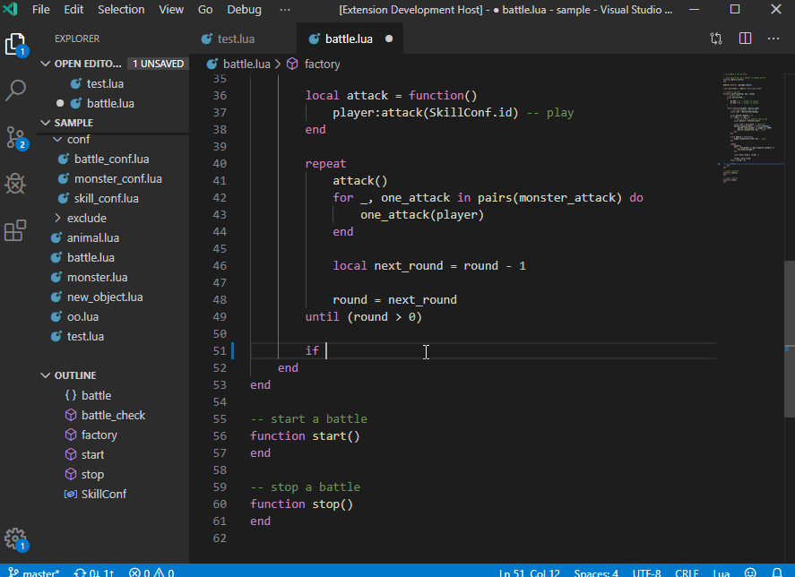
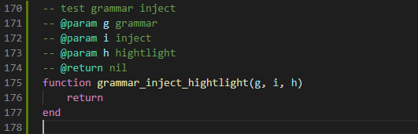

# lua-tags

Lua IntelliSense for Visual Studio Code.

## Features

- Hover
- Lint(luacheck)
- Signature Helps
- Document Symbol
- Auto Completion
- Workspace Symbol
- Go To Definition



## Configure & Usage

Download and installation are available at [Visual Studio Code Extension
Marketplace](https://marketplace.visualstudio.com/items?itemName=changnet.lua-tags).

Once installed, all configure options details are at extension Contributions page

Hot configure reload NOT support, restart Visual Studio Code to activate new
configure after configure changed

## luacheck

lua-tags already integret with luacheck(win32 and linux)，if using MacOS or other
platform, specify luaCheckPath at configure or add luacheck to os excuate PATH

## export global symbols

ctrl + shift + p: "lua-tags: export global symbols" can export all global
symbols to file(lua-tags-global-symbols) in workspace root directory.

It may help to set .luacheckrc.

## multi-root workspaces

This extension does NOT support [multi-root workspaces](code.visualstudio.com/docs/editor/multi-root-workspaces).
If it is activated at multi-root workspaces, only the first folder works.

## @param @return hightlight

Just like other language, @param、@return in comment will be hightlight by
[grammars injection](https://code.visualstudio.com/api/language-extensions/syntax-highlight-guide#injection-grammars)



## 注解（Annotation）

尽量兼容[emmylua](https://emmylua.github.io/annotation.html)和[luals](https://luals.github.io/wiki/annotations/)，但不完全兼容，并且做了很多精简。

- 数据类型
  所有的Lua类型(`string`、`number`、`function`等等)，还支持自定义的`class`，`table`会被自动当作一个类型。

```lua
EXAMPLE = {
    a = 1,
    b = 2
}

-- @field a number 成员变量a
-- @field b string 成员变量b
-- @field c EXAMPLE 成员变量c，自动把EXAMPLE当作一个类型
```

- `@param`定义函数类型，`@return`定义返回类型

```lua
-- @param a number 参数a
-- @param b boolean 参数b
-- @return string 返回类型为string
function bar(a, b)
    return "str"
end
```

- `@class`声明一个类

```lua
-- @class Foo 类名
-- @field a number 成员变量a
-- @field b string 成员变量b
-- @field c Foo[] 可嵌套其他类型
```

- 类继承

```lua
-- @class Bar:Foo 类名
-- @field x number 成员变量x
```

注意，`:`前后可允许有空格，例如`Bar : Foo`或者`Bar: Foo`

不仅仅在纯注解中支持继承，在声明一个类时也可以

```lua
-- @class Bar:Foo 类名
local Bar = {}
```

则`Bar`的类型为`Bar`，它继承了`Foo`的所有成员变量和函数。

- `[]`定义数组

```lua
-- @type Foo[] 指定a的类型为Foo的数组
local a = {}
```

- `table<k, v>`定义hash

```lua
-- @type table<number, Foo>
local a = {}
```

- `func(a:number, b:string):boolean`定义函数

```lua
-- @type func(a:number, b:string):boolean
local a = function(a, b)
    return true
end

-- 没有返回时，可以不写返回，或者返回void
-- @type func(a:number, b:string)
local a = function(a, b)
end
```

- `@alias`定义别名
  类似于C++的`typedef`和`using`，当一个类型太复杂时，可以定义一个别名。

```lua
-- @alias Foo func(a:number, b:string):boolean

-- @type Foo
local a = function(a, b)
    return true
end
```

- `@type`指定一个变量的类型

```lua
-- @type Foo 指定a的类型为Foo
local a = get_obj()
```

## RPC 前缀识别（rpcPrefix）

在某些项目里，远程调用会写成 `RPC[addr].X.Y(a, b, c)` 或 `Call[addr].X.Y(a, b, c)`
的形式。此时如果对 `X` 或 `X.Y` 进行跳转、hover、补全，默认情况下前缀
`RPC[addr].` / `Call[addr].` 可能被错误地卷入符号的 base 解析。

通过 `lua-tags.rpcPrefix` 配置一组 TypeScript 正则（带 `/g` 标志），lua-tags 会在
解析光标所在行的符号时，把匹配到的前缀连同其后紧跟的 `.` 或 `:` 一起忽略，仅提取
前缀之后的符号部分：

- `RPC[addr].X.Y` 中的 `X` 会被当作顶层符号（无 base）
- `RPC[addr].X.Y` 中的 `X.Y` 会被当作 `base=X`、`name=Y`
- 但当光标直接落在前缀本身（如 `RPC`、`Call`）上时，仍按普通符号正常搜索

配置示例（`.vscode/settings.json`）：

```json
{
    "lua-tags.rpcPrefix": [
        "RPC\\[(.*?)\\]/g",
        "Call\\[(.*?)\\]/g"
    ]
}
```

说明：

- 数组中每一项是一个字符串形式的正则，支持 `pattern/flags` 写法（如
  `RPC\[(.*?)\]/g`），也支持不带 flag 的纯 pattern（内部会自动加 `g` 以便全文扫描）。
- 正则的匹配区间若覆盖光标，则认为光标在前缀上，不剥离；否则取最后一个结束于光标
  之前、且紧跟 `.` 或 `:` 的前缀作为剥离点。
- 该特性只影响跳转 / hover / 补全时的符号切分，不影响符号定义本身的解析。

## 文件加载方式（defaultFileMode / fileMode）

Lua 有两种常见的文件加载约定：

- `load`（普通 `loadfile`）：文件顶层全局变量就是真正的全局符号。
- `module`（Lua 5.1 的 `module("name", package.seeall)`）：文件顶层全局变量会被
  挂到模块名下，不污染全局。

`lua-tags.defaultFileMode` 设置全局默认的加载方式，取值 `load` 或 `module`，默认
`load`。

`lua-tags.fileMode` 是一个数组，每项用 glob 指定一批文件单独覆盖默认值，匹配规则
为「首个匹配生效」，glob 相对工程根目录：

```json
{
    "lua-tags.defaultFileMode": "load",
    "lua-tags.fileMode": [
        { "module": true,  "files": "modules/*/*.lua" },
        { "module": false, "files": "global/*/*.lua" }
    ]
}
```

以 `module` 方式加载的文件：

- 模块名按文件相对工程根目录的路径推导，例如 `modules/sub/mod_a.lua` 的模块名为
  `modules.sub.mod_a`（与 `require("modules.sub.mod_a")` 的路径一致）。
- 文件内的顶层全局符号（函数、变量等）会挂到该模块名下，不再作为全局符号出现。
- lua-tags 会为该文件合成一个带文件位置的模块符号（可通过 `Ctrl+T` 工作区符号搜索
  到），方便跳转。
- 通过 `local M = require("modules.sub.mod_a")` 引入后，`M.greet`、`M.magic` 等
  成员仍可正常解析。
- 若文件内本身就写了显式的 `module("name")` 调用，则以显式名为准，合成模块符号
  不会被创建。

glob 语法支持 `*`（匹配单层路径段，不含 `/`）、`**`（匹配任意多层）、`?`。

## 自定义加载函数（customLoadFunc）

除 `require` 之外，有些项目会用自定义函数（如 `import`、`include`）来加载模块。
配置 `lua-tags.customLoadFunc` 后，这些函数会被当作 `require` 处理：

```json
{
    "lua-tags.customLoadFunc": ["import", "include"]
}
```

配置后，下面两种写法都会把变量绑定到 `a.b.c` 模块：

```lua
local M = import("a.b.c")
local N = include("a.b.c.lua")   -- 带 .lua 后缀会自动去掉
```

效果与 `local M = require("a.b.c")` 一致：

- `M.field` / `N.field` 能正确解析到 `a.b.c` 模块内的符号。
- 在 `import("a.b.c")` / `include("a.b.c.lua")` 上「跳转到定义」会打开对应文件。
- 输入 `import("a.` 时支持路径自动补全（与 `require` 一致）。
- 字符串参数里的 `.lua` 后缀会被自动剥离，`/`、`\` 也会归一化为 `.`。

## Thanks

- https://github.com/fstirlitz/luaparse
- https://github.com/farzher/fuzzysort
- https://github.com/lunarmodules/luacheck/
