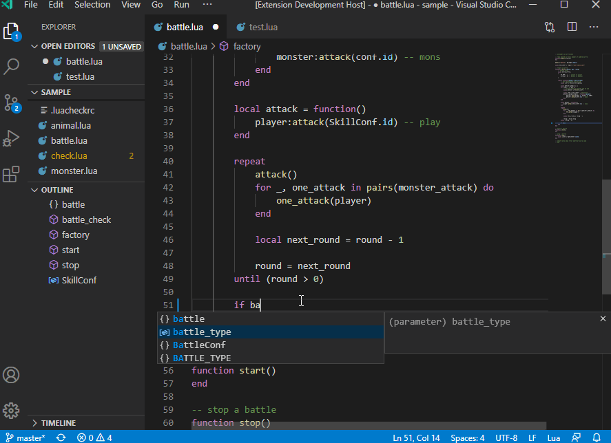

# lua-tags

Lua IntelliSense for Visual Studio Code.

## Features

* Hover
* Lint(luacheck)
* Signature Helps
* Document Symbol
* Auto Completion
* Workspace Symbol
* Go To Definition

## Configure & Usage
Download and installation are available at [Visual Studio Code Extension 
Marketplace](https://marketplace.visualstudio.com/items?itemName=changnet.lua-tags). 

Once installed, all configure options details are at extension Contributions page

Hot configure reload NOT support, restart Visual Studio Code to activate new 
configure after configure changed

## luacheck
lua-tags already integret with luacheck(win32 and linux)，if using MacOS or other
platform, specify luaCheckPath at configure or add luacheck to os excuate PATH

## export global symbols
ctrl + shift + p: "lua-tags: export global symbols" can export all global
symbols to file(lua-tags-global-symbols) in workspace root directory. It may
help to set .luacheckrc.

## multi-root workspaces
This extension does NOT support [multi-root workspaces](
code.visualstudio.com/docs/editor/multi-root-workspaces).
If it is activated at multi-root workspaces, only the first folder works.

## Thanks
* https://github.com/fstirlitz/luaparse
* https://github.com/farzher/fuzzysort
* https://github.com/mpeterv/luacheck

* https://www.cockos.com/licecap/
